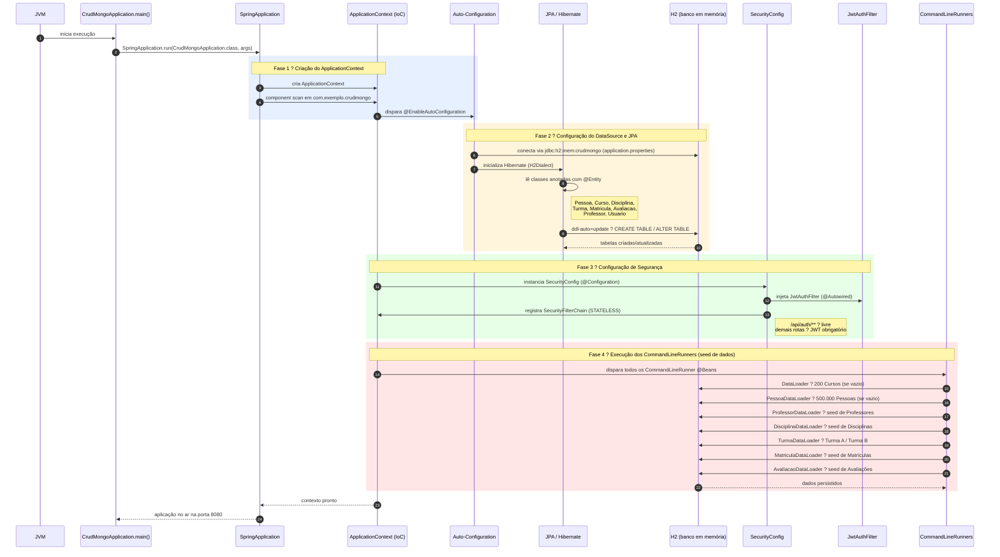

# Diagrama de Sequência ? Boot do CrudMongoApplication

## Notas explicativas

| Fase | Responsável | O que acontece |
|------|-------------|----------------|
| 1 ? IoC Container | `@SpringBootApplication` | Escaneia todos os pacotes filhos e registra beans (`@Component`, `@Service`, `@Repository`, `@Configuration`) |
| 2 ? JPA/Hibernate | `spring.jpa.hibernate.ddl-auto=update` | Hibernate compara as `@Entity` com o banco H2 e emite DDL para criar ou ajustar as tabelas |
| 3 ? Security | `SecurityConfig` + `JwtAuthFilter` | Monta a cadeia de filtros HTTP; todo request passará pelo filtro JWT antes de chegar aos controllers |
| 4 ? Data Seed | `CommandLineRunner` em cada `*DataLoader` | Após o contexto estar 100% pronto, cada loader verifica se a coleção está vazia e insere dados de teste com Faker |
