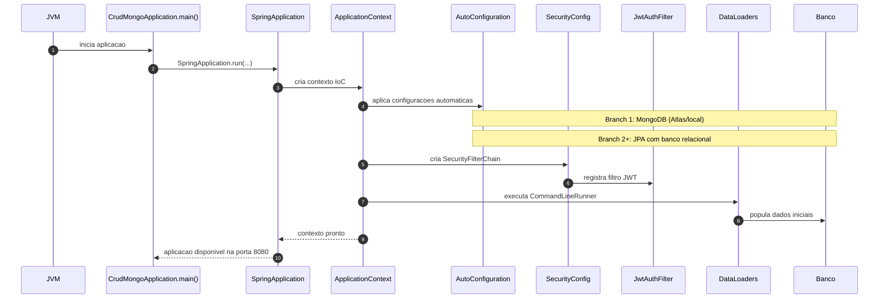

# Diagrama de Sequencia - Boot da Aplicacao

Fluxo de inicializacao do backend com observacao da mudanca de persistencia entre as branches.

## Pontos de verificacao

1. Inicializacao sem erro de conexao com banco.
2. Endpoints de autenticacao respondendo em `/api/auth/*`.
3. Endpoints de dominio respondendo com token valido.
