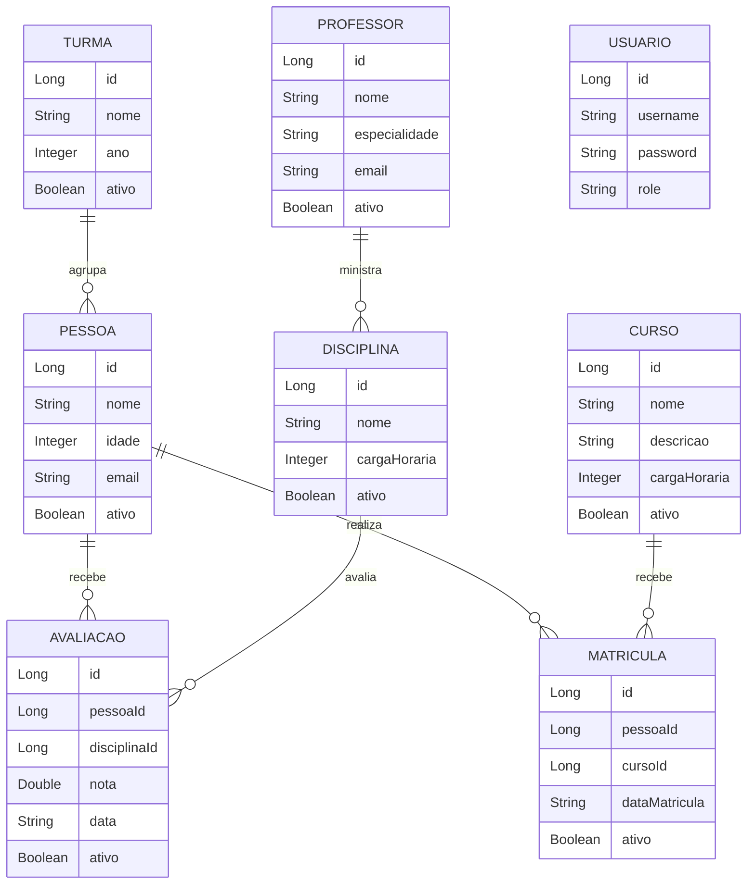

# Diagrama de Entidades - Dominio Academico

Visao consolidada das entidades do projeto monolitico e das relacoes de negocio.

## Endpoints centrais para validacao funcional

1. `GET /api/pessoas`
2. `GET /api/curso`
3. `GET /api/professor`
4. `GET /api/disciplina`
5. `GET /api/turma`
6. `GET /api/matricula`
7. `GET /api/avaliacao`
8. `POST /api/auth/login`
