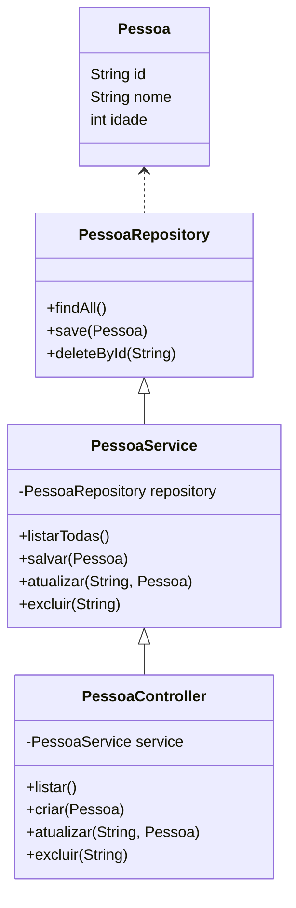
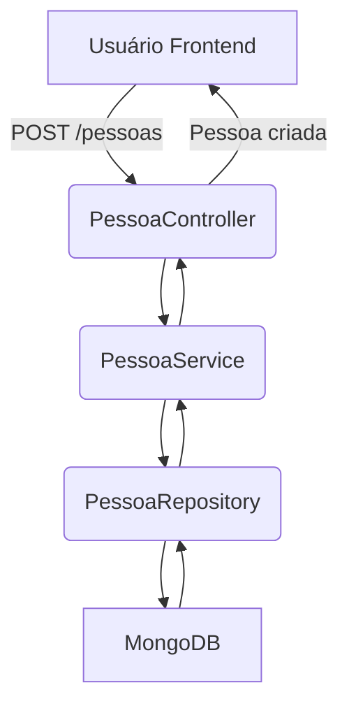
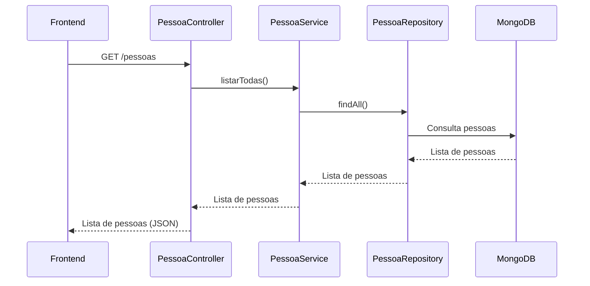
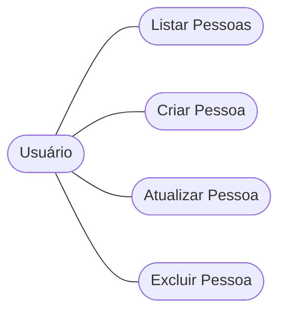

# Diagramas da Entidade Pessoa

## Diagrama de Classes

```mermaid
classDiagram
    class Pessoa {
        String id
        String nome
        int idade
    }
    class PessoaRepository {
        +findAll()
        +save(Pessoa)
        +deleteById(String)
    }
    class PessoaService {
        -PessoaRepository repository
        +listarTodas()
        +salvar(Pessoa)
        +atualizar(String, Pessoa)
        +excluir(String)
    }
    class PessoaController {
        -PessoaService service
        +listar()
        +criar(Pessoa)
        +atualizar(String, Pessoa)
        +excluir(String)
    }
    PessoaRepository <|-- PessoaService
    PessoaService <|-- PessoaController
    Pessoa <.. PessoaRepository
```

---

## Diagrama de Fluxo (CRUD Pessoa)

```mermaid
flowchart TD
    A[Usuário Frontend] -->|POST /pessoas| B(PessoaController)
    B --> C(PessoaService)
    C --> D(PessoaRepository)
    D --> E[MongoDB]
    E --> D
    D --> C
    C --> B
    B -->|Pessoa criada| A
```

---

## Diagrama de Sequência (Listar Pessoas)

```mermaid
sequenceDiagram
    participant Frontend
    participant Controller as PessoaController
    participant Service as PessoaService
    participant Repository as PessoaRepository
    participant DB as MongoDB

    Frontend->>Controller: GET /pessoas
    Controller->>Service: listarTodas()
    Service->>Repository: findAll()
    Repository->>DB: Consulta pessoas
    DB-->>Repository: Lista de pessoas
    Repository-->>Service: Lista de pessoas
    Service-->>Controller: Lista de pessoas
    Controller-->>Frontend: Lista de pessoas (JSON)
```

---

## Diagrama de Caso de Uso

```mermaid
flowchart LR
    User([Usuário])
    UC1([Listar Pessoas])
    UC2([Criar Pessoa])
    UC3([Atualizar Pessoa])
    UC4([Excluir Pessoa])

    User --- UC1
    User --- UC2
    User --- UC3
    User --- UC4
```
