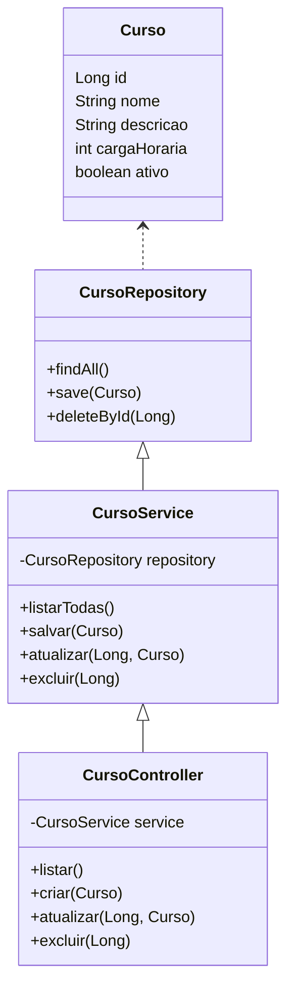
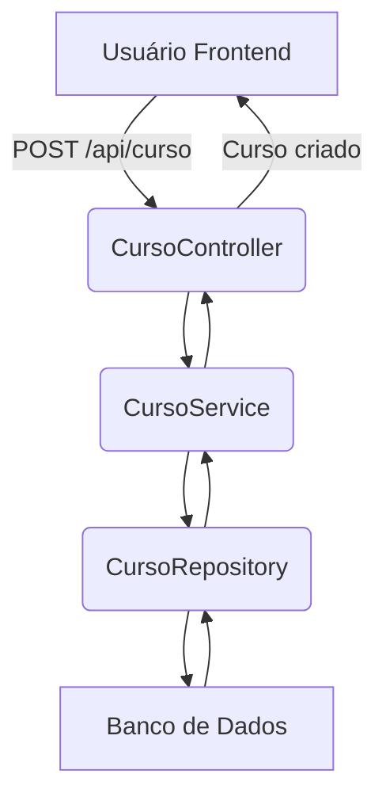
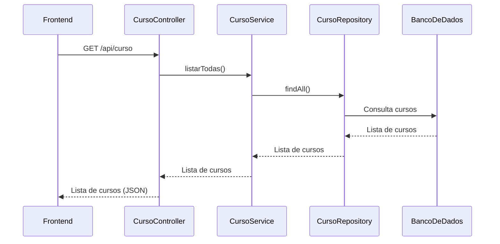
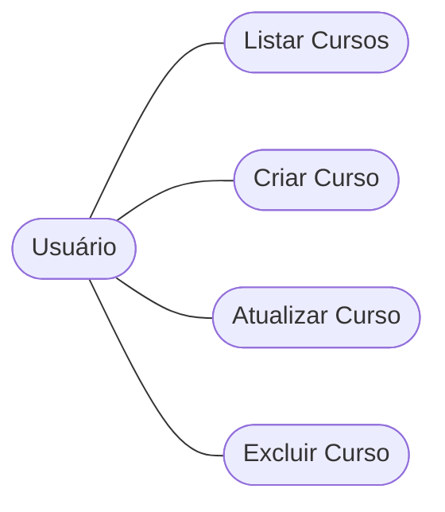

# Diagramas do Projeto CRUD Fullstack

## Diagrama de Classes

```mermaid
classDiagram
    class Curso {
        Long id
        String nome
        String descricao
        int cargaHoraria
        boolean ativo
    }
    class CursoRepository {
        +findAll()
        +save(Curso)
        +deleteById(Long)
    }
    class CursoService {
        -CursoRepository repository
        +listarTodas()
        +salvar(Curso)
        +atualizar(Long, Curso)
        +excluir(Long)
    }
    class CursoController {
        -CursoService service
        +listar()
        +criar(Curso)
        +atualizar(Long, Curso)
        +excluir(Long)
    }
    CursoRepository <|-- CursoService
    CursoService <|-- CursoController
    Curso <.. CursoRepository
```

---

## Diagrama de Fluxo (CRUD Curso)

```mermaid
flowchart TD
    A[Usuário Frontend] -->|POST /api/curso| B(CursoController)
    B --> C(CursoService)
    C --> D(CursoRepository)
    D --> E[Banco de Dados]
    E --> D
    D --> C
    C --> B
    B -->|Curso criado| A
```

---

## Diagrama de Sequência (Listar Cursos)

```mermaid
sequenceDiagram
    participant Frontend
    participant Controller as CursoController
    participant Service as CursoService
    participant Repository as CursoRepository
    participant DB as BancoDeDados

    Frontend->>Controller: GET /api/curso
    Controller->>Service: listarTodas()
    Service->>Repository: findAll()
    Repository->>DB: Consulta cursos
    DB-->>Repository: Lista de cursos
    Repository-->>Service: Lista de cursos
    Service-->>Controller: Lista de cursos
    Controller-->>Frontend: Lista de cursos (JSON)
```

---

## Diagrama de Caso de Uso

```mermaid
flowchart LR
    User([Usuário])
    UC1([Listar Cursos])
    UC2([Criar Curso])
    UC3([Atualizar Curso])
    UC4([Excluir Curso])

    User --- UC1
    User --- UC2
    User --- UC3
    User --- UC4
```
